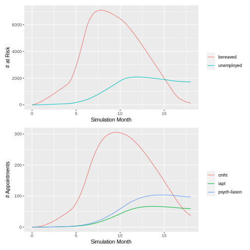

# Covid Surge Modelling to Mental Health Services

| Item         | Value          |
|--------------|----------------|
| Project Code | 723            |
| Project Lead | Andrew Hood    |


## Running the model


```r
library(tidyverse, quietly = TRUE)
```

```
## -- Attaching packages --------------------------------------- tidyverse 1.3.0 --
```

```
## v ggplot2 3.3.1     v purrr   0.3.4
## v tibble  3.0.1     v dplyr   1.0.0
## v tidyr   1.1.0     v stringr 1.4.0
## v readr   1.3.1     v forcats 0.5.0
```

```
## -- Conflicts ------------------------------------------ tidyverse_conflicts() --
## x dplyr::filter()  masks stats::filter()
## x purrr::is_null() masks testthat::is_null()
## x dplyr::lag()     masks stats::lag()
## x dplyr::matches() masks tidyr::matches(), testthat::matches()
```

```r
library(deSolve)
library(patchwork)

source("half_life_factor.R")
source("run_model.R")

# Params ----
param_csv <- read_csv("sample_params.csv", col_types = "cccddddd") %>%
  unite(rowname, group:condition, sep = "_", na.rm = TRUE) %>%
  mutate_at("decay", ~half_life_factor(days, .x)) %>%
  select(-days)

params <- param_csv %>%
  select(pcnt:decay) %>%
  as.matrix() %>%
  t()
colnames(params) <- param_csv$rowname

# Simulated demand surges ----
new_potential <- list(
  unemployed = approxfun(
    c(0, 4, 6, 10, 16),
    c(100, 2000, 8000, 6000, 0),
    rule = 2
  ),
  bereaved = approxfun(
    c(0, 4, 6, 10, 16),
    c(0, 100, 500, 2000, 1500),
    rule = 2
  )
)

# Run model ----
o <- run_model(params, new_potential)

o
```

```
## # A tibble: 4,869 x 6
##      time type        group      treatment    condition   value
##     <dbl> <chr>       <chr>      <chr>        <chr>       <dbl>
##  1 0      no-mh-needs <NA>       <NA>         <NA>            0
##  2 0      at-risk     bereaved   <NA>         <NA>            0
##  3 0      at-risk     unemployed <NA>         <NA>            0
##  4 0      treatment   bereaved   cmht         bereavement     0
##  5 0      treatment   unemployed cmht         insomnia        0
##  6 0      treatment   unemployed cmht         stress          0
##  7 0      treatment   unemployed iapt         anxiety         0
##  8 0      treatment   unemployed iapt         depression      0
##  9 0      treatment   unemployed psych-liason suicide         0
## 10 0.0333 no-mh-needs <NA>       <NA>         <NA>            0
## # ... with 4,859 more rows
```


```r
# Show plots ----
p1 <- o %>%
  filter(type == "at-risk") %>%
  ggplot(aes(time, value, colour = group)) +
  geom_line() +
  labs(x = "Simulation Month",
       y = "# at Risk",
       colour = "")

p2 <- o %>%
  filter(type == "treatment") %>%
  group_by(time, treatment) %>%
  summarise(across(value, sum), .groups = "drop") %>%
  inner_join(tribble(
    ~treatment, ~average_monthly_appointments,
    "cmht", 4,
    "iapt", 6,
    "psych-liason", 30
  ), by = "treatment") %>%
  ggplot(aes(time, value * average_monthly_appointments, colour = treatment)) +
  geom_line() +
  labs(x = "Simulation Month",
       y = "# Appointments",
       colour = "")

p1 + p2 + plot_layout(ncol = 1)
```


