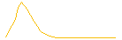
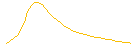
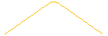
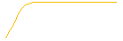
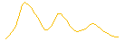

```{r, include = FALSE}
knitr::opts_chunk$set(
  collapse = TRUE,
  comment = "#>"
)
```

This document describes the nature of the open source covid-19 mental health surge model developed by the [Strategy Unit][su]. The model code can be found on [GitHub][gh] and the interactive application can be found [here][app]. 

We welcome contributions and suggestions, but cannot promise to incorporate all in future iterations. You can contact
us on our [website][su_contact].

## Modelling approach 


Our whole population simulation model is based on a system dynamics approach. The stocks in our model represent a) population risk groups exposed to covid-19 either directly or indirectly; b) the buckets of conditions/symptoms they may develop; c) the services that they may present to and receive treatment from. You can read more in `vignette("model")`. 

Initial population stocks have been derived from multiple open access, routine datasets or estimated from contemporaneous literature ([Evidence_summary_MH.xlsx][evidence_file]). 

Effect sizes have been determined with reference to early national and international literature on the Covid-19 pandemic and similar previous one-off events or epidemics e.g. SARS, MERS, Boston Marathon lockdown. We accept this has become out-of-date quite quickly.  

The flow variables in our model are determined by empirical data extracted from the national Mental Health Services Data Set (MHSDS). 

The mapping of likely flows of conditions to services was initially developed in conjunction with a multi-disciplinary team from Mersey Care Foundation NHS Trust. 

## Flow and pathway variables explained 

In order for our simplification of the mental health pathway to reflect near-reality we have chosen to introduce several variables across our model: 

| Variable | Description | Derivation |
|----------|-------------|------------|
| Referrals receiving service | Not all patients referred will receive a treatment, some will not meet thresholds and others may refuse or drop-out before treatment begins. | MHSDS tables MHS101, MHS102 and MHS201 or IAPT V1.5. All completed referrals made during 2018. % of those that had a clinical contact after the date of referral and were not discharged before treatment began. | 
| Time in treatment | The length of time (in months) that patients in each service stay on caseload. Implemented here as a 50% decay function. | MHSDS tables MHS101, MHS102. All completed referrals made during 2018. Median whole months between referral and discharge dates for each service. |
| Treatment success | The likelihood that patients will require further treatment after discharged from current service. |  MHSDS tables MHS101, MHS102. All completed referrals made during 2018. % of patients discharged that were referred to any mental health team within 12 months of discharge (or re-admission for inpatient services). |
| Demand multiplier | The intensity of service provided for patients in each service. Could relate to any aspect of care activity – OP appointments, community contacts, inpatient beddays. | MHSDS tables MHS101, MHS102, MHS201, MHS501 or IAPT v1.5. All completed referrals made during 2018. Count of clinical care contact days (clinical care contact time > 0 or IAPT therapy sessions) between dates of referral and discharge. Calculated as units per patient per month. |

## Additional assumptions explained 

### Demand scenarios 

To simulate future demand, our approach requires an assumption about the rates at which the effects from the pandemic, as determined by the literature, might be distributed over time. We developed five scenarios to provide differing views. These will only marginally change the overall effect sizes as a result of the differential flows through the model.

```{r, include = FALSE}
library(ggplot2)
library(dplyr)
library(mhSurgeModelling)
library(purrr)

params$curves %>%
  iwalk(function(.x, .y) {
    p <- tibble(x = seq_along(.x), y = .x) %>%
      ggplot(aes(x, y)) +
      geom_line(colour = "#f8bf07") +
      theme_void()
    
    ggsave(paste0("curve ", .y, ".png"), p, width = 1.5, height = 0.5, dpi = 92)
  })

```

| Scenario   | Description and rationale | Example distribution curve |
|------------|---------------------------|----------------------------|
Sudden Shock | The impacts will materialise soon after the initial wave and lockdown and then drop off quickly afterwards as the economy and society recovers. |  |
| Prolonged Pandemic | An extended curve that ‘stretches out’ the traditional epidemic curve over 36 months. There will likely be some lag in the effects taking hold and also a lag in the recovery from the impacts. |  |	 
| Even Ebb | A steady rise in needs followed by an equivalent drop as individuals’ and populations adjust and develop coping mechanisms	|  |
| Incubating impacts | Short-term rise that then plateaus off as demand for support remains steady and consistent. The 3 year horizon truncates this scenario. |  |
| Fluctuating Fears | Broadly consistent with one major peak in each year but reducing in severity over time. |  |

### Psychiatric co-morbidity

Many patients will develop co-morbid psychological issues such as anxiety and depression, insomnia and distress, psychosis and substance misuse. Our model is simplified however to single and independent incidence of new conditions, as is virtually all the emerging literature specific to covid-19. Based on the findings in Kessler RC et al [Prevalence, Severity, and Comorbidity of Twelve-month DSM-IV Disorders in the National Comorbidity Survey Replication (NCS-R), 2005] we have assumed an average number of presenting morbidities of 2 and have effectively halved the effects laid out in the impact literature we reviewed.

The segmented populations that provide the initial inputs for the model are taken from multiple sources and with the potential for significant overlap. Similarly, some studies have very specific case definitions of risk groups, but our population denominators are broad by necessity. In order to mitigate this risk we have made 2 explicit adjustments.

1. Reduction of the populations with existing physical and mental health conditions. We have pragmatically reduced all these populations by 1/3 as people often have acute co-morbid issues.
2. A susceptibility and resilience moderator. This adjustment varies by population group, but is intended to provide a reasonable sense of how vulnerable the populations are likely to be to the effects of change and how likely they are to quickly adapt. The broad categories that we have applied are:
    - 10% of population sub-group at 'risk' - Generic groups, low risk and resilient
    - 25% of population sub-group at 'risk' - Broad groups, some existing health needs
    - 50% of population sub-group at 'risk' - Broad groups with specific existing MH needs
    - 75% of population sub-group at 'risk' - Specific groups with direct links to covid

[su]: https://www.strategyunitwm.nhs.uk/
[su_contact]: https://www.strategyunitwm.nhs.uk/contact
[gh]: https://github.com/The-Strategy-Unit/723_mh_covid_surge_modelling/ 
[app]: https://strategyunit.shinyapps.io/MH_Surge_Modelling/

[evidence_file]: https://github.com/The-Strategy-Unit/723_mh_covid_surge_modelling/raw/evidence_files/Evidence_summary_MH.xlsx
